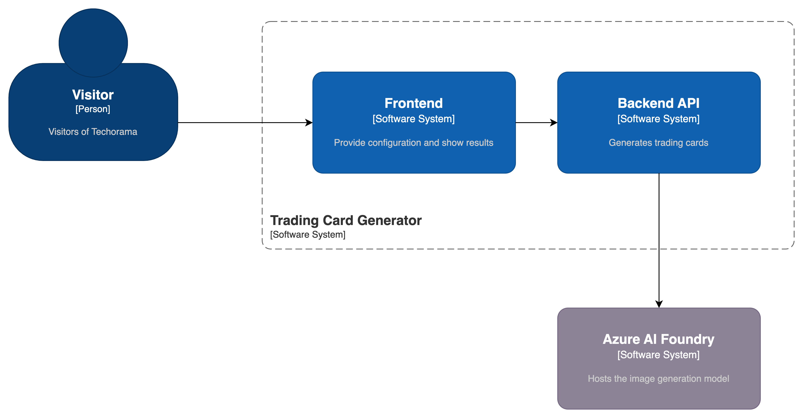

# Context and scope

This section covers the context and scope of the system.

## Context of the application

- The application runs on a portable device that we'll bring along to Techorama.
- We communicate with Azure AI Foundry to generate images
- No data is saved by the application

