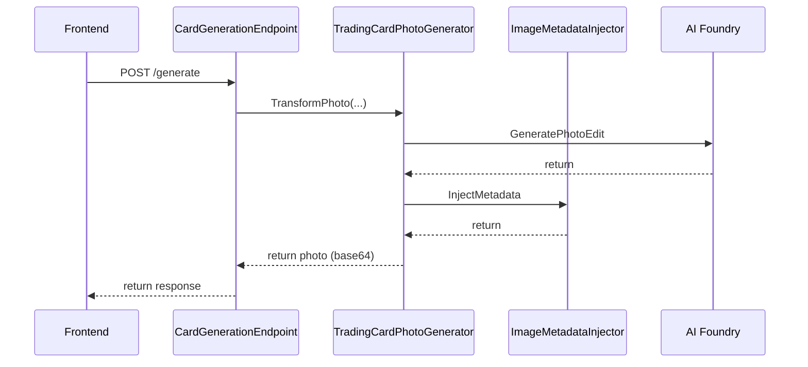

# Runtime view

This section covers the key runtime scenarios in the application.

## Generating a photo

We use the photo edit functionality of GPT-image-1 to generate the photo. This takes an
existing photo or set of photos as input combined with a prompt to produce the end result.

The prompt controls how the photo is edited and includes instructions how to include
the various settings into the photo.
